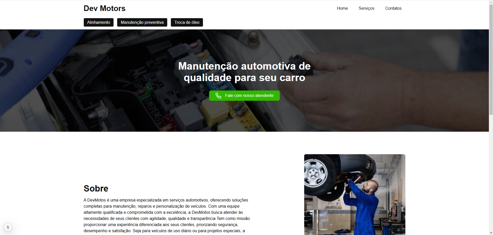
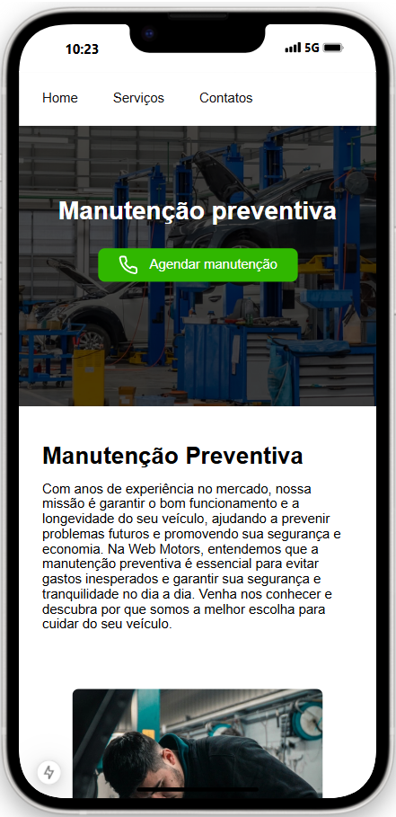
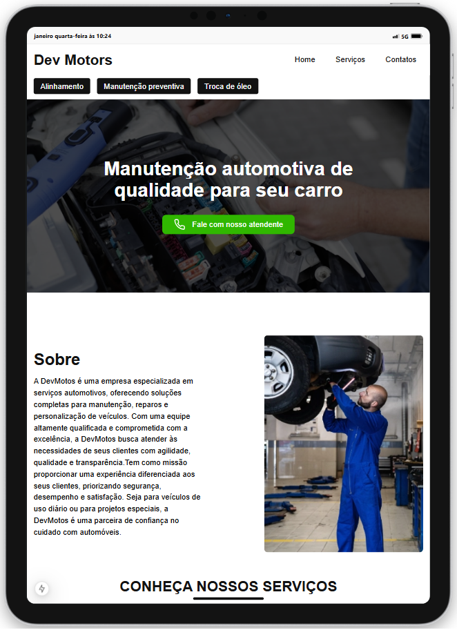
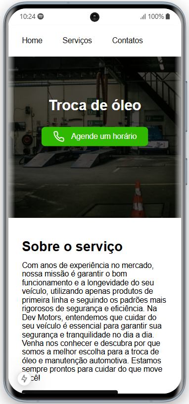
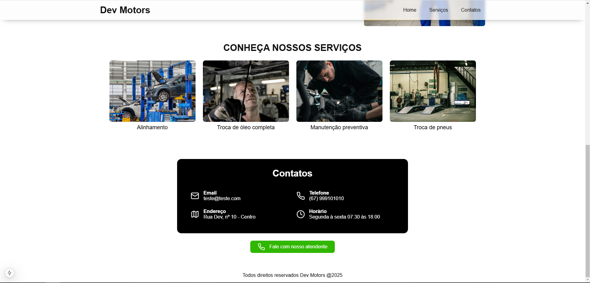

# DevMotors



O **DevMotors** é uma _single page_ de nível profissional com renderização de novas páginas via requisição, com tema de manutenção automotiva. Desenvolvido com _Next, Tailwind, e TypeScript_, o site utiliza API padrão RESTFUL, via _Cosmic js_ para gerenciamento de dados.
## Sumário

1. [Visão Geral do Projeto](#visão-geral-do-projeto-funcionalidades-principais)
   - [Página princial](#1-página-principal)
   - [Geração de páginas](#2-páginas-geradas)
2. [Tecnologias Utilizadas](#tecnologias-utilizadas-linguagens-e-ferramentas)
3. [Estrutura do Projeto](#estrutura-do-projeto)
5. [Screenshots](#screenshots)
   - [Iphone 14 pro max](#iphone-14-pro-max)
   - [Ipad pro](#ipad-pro)
   - [Mobile](#mobile)
   - [Desk](#desktop)
6. [Requisitos para Rodar o Projeto Localmente](#requisitos-para-rodar-o-projeto-localmente)
7. [Rodar o Projeto Localmente](#rodar-o-projeto-localmente)
8. [Autores](#autores)
9. [Licença](#licença)

## Visão Geral do Projeto (Funcionalidades Principais)

### 1. Página principal:

- **Capa:** Mostra a capa da empresa DevMotors ou serviço correspondente a página.
- **Botão CTA:** Ao clicar será redirecionado ao contato direto com a empresa.
- **Descrição:** Uma seção de sobre a empresa ou serviço.
- **Serviços:** Lista os serviços prestados pela empresa.
- **Contatos:** Mostra todos os meios de contatos da empresa de forma elegante.

### 2. Páginas geradas:

- Temos a funcionalidade de gerar novas páginas recebendo as informações via requisição API, que realizamos com _Cosmic js_.

## Tecnologias Utilizadas (Linguagens e ferramentas)

<table>
    <tr>
      <td align="center">
        <a href="https://nextjs.org/">
          
          <br />
          <sub>
            <b>Next.JS</b>
          </sub>
        </a>
      </td>
      <td align="center">
        <a href="https://tailwindcss.com/">
          
          <br />
          <sub>
            <b>Tailwind CSS</b>
          </sub>
        </a>
      </td>
      <td align="center">
        <a href="https://www.typescriptlang.org/">
          
          <br />
          <sub>
            <b>TypeScript</b>
          </sub>
        </a>
      </td>
    </tr>
</table>
<table border-style="none">
  <tr>
    <td align="center">
      <a href="https://app.cosmicjs.com">
        <sub>
          <b>Cosmic</b>
        </sub>
      </a>
    </td>
    <td align="center">
      <a href="https://git-scm.com/">
        <br />
        <sub>
          <b>Git</b>
        </sub>
      </a>
    </td>
    <td align="center">
      <a href="https://github.com/">
        
        <br />
        <sub margin-top="50px;">
          <b>Github</b>
        </sub>
      </a>
    </td>
  </tr>
</table>

## Estrutura do Projeto

O projeto é organizado em vários arquivos para melhor organização do código e separação de interesses:

- `public/`: A pasta serve como o local para armazenar arquivos estáticos que não passam pelo processo de build do React e podem ser acessados diretamente no navegador.
- `src/`: Onde encontra-se o processo de desenvolvimento de todo o código-fonte do sistema.
- `components/`: A pasta contém todos os componentes utilizados na aplicação.
- `post/`: A pasta contém toda a estrutura das páginas responsivas.
- `utils/`: A pasta contém toda lógica que é compartilhada e utiliza em todo código.
- `layout/`: Onde encontra-se a configuração de estruturação do layout e metadatas do site.
- `index.css`: Onde encontra-se a estilização global da aplicação.

## Screenshots

### Iphone 14 pro max



### Ipad pro



### Mobile



### Desktop




## Requisitos para Rodar o Projeto Localmente

### Node.js e npm:

- Verifique se você tem o Node.js instalado. Caso contrário, faça o download e instale a versão mais recente do Node.js.
- O npm (Node Package Manager) é instalado automaticamente com o Node.js.

### Git:

- Certifique-se de ter o Git instalado em sua máquina. Se não tiver, você pode baixá-lo aqui.

### Editor de Texto ou IDE:

- Escolha um editor de texto ou uma IDE (Ambiente de Desenvolvimento Integrado) para trabalhar no código. Alguns exemplos populares incluem o Visual Studio Code, Sublime Text e Atom.

### Navegador Web:

- Você precisará de um navegador web para visualizar o aplicativo localmente. Recomendamos o uso do Google Chrome, Mozilla Firefox ou Microsoft Edge.

## Rodar o Projeto Localmente

**Clone o projeto**

```bash
  git clone https://github.com/MarcioJorgeMelo/DevMotors.git
```

**Vá para a pasta do projeto**

```bash
  cd devmotors
```

**Abra o projeto no VSCode**

```bash
  code .
```

**Instale as dependências**

```bash
  npm install # Instala as dependências (se ainda não tiver feito)
```

**Abra com o React Server**

```bash
  npm run dev # Inicia o servidor NextJS
```

## Autores

- [@MarcioJorgeMelo](https://github.com/MarcioJorgeMelo)

## Licença

- [MIT](https://choosealicense.com/licenses/mit/)
